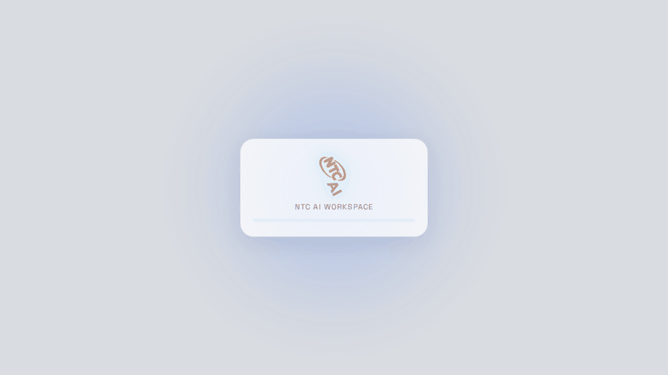
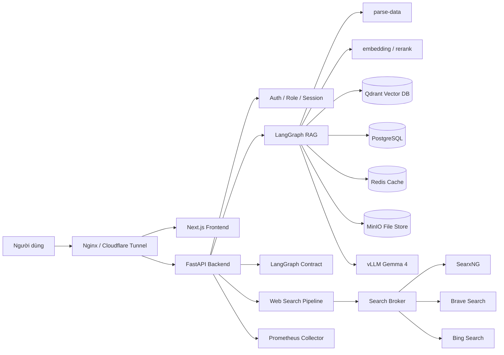
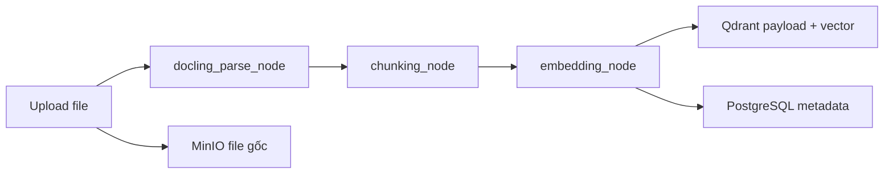
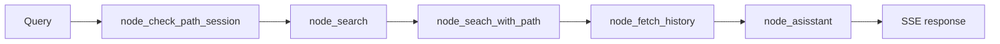
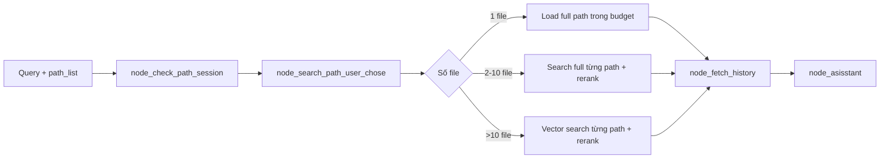
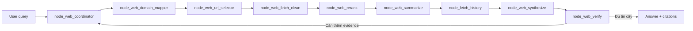
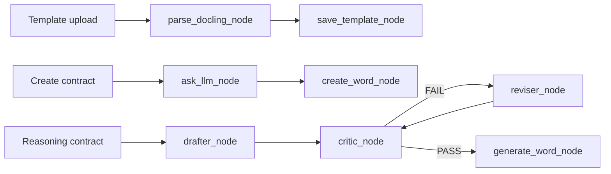

<div align="center">



# RAG Chat Platform

**Nền tảng hỏi đáp tài liệu, tìm kiếm web có kiểm chứng và tạo hợp đồng chạy bằng pipeline AI nội bộ.**

[Tổng quan](#tổng-quan) •
[Cần key gì](#cần-key-gì) •
[Kiến trúc](#kiến-trúc) •
[Pipeline RAG](#pipeline-rag) •
[Vận hành](#vận-hành) •
[Tài liệu](#tài-liệu)


</div>

## Tổng quan

Repo này là một workspace production cho chatbot nội bộ. Hệ thống không chỉ gọi LLM, mà tổ chức đầy đủ các bước cần có để trả lời có căn cứ: nhập tài liệu, parse, chunk, embedding, truy xuất vector, rerank, gom context theo ngân sách token, nạp lịch sử hội thoại, stream phản hồi và lưu lại kết quả.

Các runtime chính:

- `backend`: FastAPI điều phối auth, RAG, hợp đồng, history, admin, analytics.
- `frontend`: Next.js cho chat, quản trị, file manager, session và contract UI.
- `parse-data`: service parse tài liệu sang markdown.
- `embedding`: service embedding và rerank.
- `vllm`: OpenAI-compatible inference server cho model chat nội bộ.
- `postgres`, `qdrant`, `redis`, `minio`: lớp dữ liệu, cache và object storage.
- `nginx`, `prometheus`, exporters: reverse proxy và vận hành.

Mục tiêu kỹ thuật của dự án là giữ pipeline rõ ràng, giảm chi phí GPU, kiểm soát token theo từng nhánh xử lý và vẫn đủ bằng chứng để trả lời ổn định trong môi trường triển khai thật.

## Cần key gì

Fresh clone có thể chạy bằng một lệnh:

```bash
bash ./run_all_services.sh
```

Nếu chưa có `.env`, script tự tạo từ `.env.example`. Sau đó sửa `.env` ở root repo, không sửa trực tiếp `.env.example` cho secret thật.

Nếu máy đã có Hugging Face cache ở thư mục khác, có thể truyền ngay trong lệnh đầu tiên:

```bash
HF_CACHE_MOUNT=/path/to/cache/huggingface bash ./run_all_services.sh
```

### Tối thiểu để chạy local

| Mục | Bắt buộc? | Sửa ở đâu | Ghi chú |
| --- | --- | --- | --- |
| NVIDIA GPU + Docker NVIDIA runtime | Có | Máy host | vLLM/embedding/rerank cần GPU để chạy ổn định. |
| Hugging Face model cache hoặc token | Có nếu cache trống/model gated | `.env`: `HF_TOKEN` hoặc `HUGGING_FACE_HUB_TOKEN` | Dùng để tải `google/gemma-4-E4B-it` khi `cache/huggingface` chưa có model. Nếu máy đã có cache thì có thể để trống. |
| Secret nội bộ local | Nên đổi | `.env`: `JWT_SECRET_KEY`, `ROOT_EMAIL`, `ROOT_PASSWORD`, `POSTGRES_PASSWORD`, `REDIS_PASSWORD`, `MINIO_SECRET_KEY`, `SEARXNG_SECRET` | `.env.example` chỉ dùng placeholder `change_me`. Production bắt buộc đổi. |
| Port local | Có | `.env` | Giữ trong dải `6100-6150`; script sẽ validate trước khi chạy. |

Tài khoản root local để vào web test được tạo từ `.env`: `ROOT_EMAIL` và `ROOT_PASSWORD`. Fresh clone mặc định là `admin@example.com` / `change_me`; đổi hai biến này trước khi chạy production hoặc demo công khai.

### Optional nhưng giúp chạy đủ chức năng

| Chức năng | Key/env | Khi không có key |
| --- | --- | --- |
| Web search provider ngoài | `BRAVE_SEARCH_API_KEY`, `BING_SEARCH_API_KEY` | Hệ thống vẫn dùng SearxNG local, chất lượng/latency phụ thuộc provider public. |
| Provider LLM ngoài | `NVIDIA_API_KEY`, `OPENROUTER_API_KEY`, `GROQ_API_KEY` | Không ảnh hưởng local vLLM; các provider ngoài chỉ inactive/không infer được nếu thiếu key. |
| GeoIP đầy đủ | `MAXMIND_LICENSE_KEY` hoặc `GEOIP_CITY_DB_URL`, `GEOIP_ASN_DB_URL` | Fresh clone vẫn chạy với `GEOIP_STRICT=false`; IP geolocation bị degrade. |
| Cloudflare/domain production | `FRONTEND_URL`, `BACKEND_URL`, `NEXT_PUBLIC_APP_URL`, `CORS_ALLOW_ORIGINS` | Local mặc định dùng `http://localhost:6101`. |

Không commit `.env`, token, cookie, private key hoặc file `.mmdb` runtime. Nếu lỡ lộ key, rotate/revoke key trước khi push lại.

## Kiến trúc



Thiết kế tách service theo trách nhiệm. Backend giữ vai trò orchestrator, còn parse, embedding, rerank và inference chạy như các service độc lập để dễ scale, restart và đo tài nguyên.

## Module Matrix

| Module | Vai trò | Điểm cần biết khi sửa |
| --- | --- | --- |
| `backend/agent_chatbot/graph` | Khai báo LangGraph workflow | Giữ thứ tự node và router rõ ràng, tránh nhét logic xử lý vào graph |
| `backend/agent_chatbot/node` | Node pipeline và SSE event | Mỗi node đẩy trạng thái cho frontend, logic nặng nằm ở `util` |
| `backend/agent_chatbot/node/util` | Retrieval, rerank, prompt, web evidence | Đây là lõi hiệu năng RAG, thay đổi phải có test smoke |
| `backend/service/history_pipeline_service.py` | Nạp history liên quan | Giảm nhiễu prompt bằng history có chọn lọc |
| `embedding/src/service` | Embedding và rerank | Tách khỏi backend để tránh nghẽn CPU/GPU trong API |
| `parse-data/src/service` | Parse tài liệu | Chuẩn hóa tài liệu đầu vào trước khi chunk |
| `frontend/src/app/chat` | Chat UI và SSE | Phản ánh tiến độ từng node để user không thấy hệ thống bị đứng |
| `docker-compose*.yml` | Hạ tầng local/prod | Dùng cache volume cố định, vLLM chạy GPU, Nginx là public entrypoint |

## Pipeline RAG

### 1. Upload và index tài liệu



Luồng upload có ba node chính trong `backend/agent_chatbot/graph/rag_graph.py`:

1. `docling_parse_node`: gọi parse service để chuyển file thành markdown sạch.
2. `chunking_node`: cắt theo heading, giữ `heading_group_id` để các phần thuộc cùng mục có thể được ghép lại.
3. `embedding_node`: tạo vector cho từng chunk và ghi vào Qdrant.

Điểm quan trọng là chunk không chỉ là lát cắt text. Mỗi chunk mang theo heading, path, group id và metadata để retrieval có thể lấy lại đúng đoạn theo cấu trúc tài liệu.

### 2. Truy vấn RAG tự động



Khi user không chọn file cụ thể, backend chạy nhánh tự động:

1. Tạo embedding cho câu hỏi.
2. Query Qdrant theo group path để tìm tài liệu ứng viên.
3. Rerank các chunk bằng service rerank, chỉ giữ path có điểm đủ tốt.
4. Với từng path đạt ngưỡng, truy vấn lại theo heading để lấy context chi tiết.
5. Nạp history liên quan.
6. Gọi vLLM và stream token về frontend qua SSE.

Nhánh này tối ưu tốc độ bằng cách không đọc toàn bộ tài liệu ngay từ đầu. Hệ thống tìm path trước, rerank trước, rồi mới mở rộng context cho những path có khả năng trả lời cao.

### 3. Truy vấn theo file user chọn



Đây là điểm đáng giá của pipeline hiện tại. Logic không xử lý mọi trường hợp như nhau:

- Một file: ưu tiên lấy nội dung file trong budget để tránh mất chi tiết.
- Từ 2 đến 10 file: search hết chunk theo từng path, rerank riêng từng file, giữ nguyên heading quan trọng.
- Trên 10 file: dùng vector search theo path để giảm tải, sau đó rerank và ghép context.

Nhờ vậy hệ thống vừa nhanh khi người dùng chọn nhiều file, vừa ít rủi ro bỏ sót khi chỉ hỏi trên một tài liệu.

### 4. Budget token và prompt

Các ngưỡng hiện đọc từ env root, không hard-code vào pipeline:

| Biến | Mặc định hiện tại | Vai trò |
| --- | --- | --- |
| `LLM_CONTEXT_WINDOW` | `8192` | Cửa sổ context vLLM local ổn định trên GB10/DGX Spark khi còn chạy dịch vụ nền |
| `LLM_MAX_TOKENS` | `10000` | Output tối đa cho model |
| `VLLM_KV_CACHE_MEMORY_BYTES` | `2147483648` | KV cache thủ công 2GiB để tránh lỗi vLLM memory profiling trên unified memory |
| `RAG_INPUT_TOKEN_BUDGET` | `50000` | Ngân sách input tổng |
| `RAG_OUTPUT_TOKEN_BUDGET` | `10000` | Ngân sách output RAG |
| `RAG_FILE_CONTEXT_TOKEN_BUDGET` | `40000` | Phần context tài liệu |
| `RAG_HISTORY_TOKEN_BUDGET` | `10000` | Phần history liên quan |
| `RAG_SELECTED_PATH_TOKEN_BUDGET` | `50000` | Budget khi user chọn path |
| `RAG_AVG_TOKENS_PER_CHUNK` | `600` | Ước lượng chunk để chia quota theo path |
| `RAG_CHARS_PER_TOKEN` | `2.5` | Quy đổi token sang ký tự khi cắt context |

Prompt cuối cùng được xếp theo thứ tự ổn định cho cache: context chính, history liên quan, câu hỏi mới. Cách này giúp giảm nhiễu từ history và giữ phần tài liệu có giá trị ở gần đầu prompt.

## Web Search Pipeline



Web search không chỉ lấy vài URL rồi nhét vào prompt. Pipeline có broker đa provider, source policy, title-aware URL selection, fetch clean, rerank evidence, tóm tắt theo câu hỏi nghiên cứu và verifier loop. Nếu evidence chưa đủ, verifier có thể yêu cầu research loop tiếp theo trong giới hạn cấu hình.

Các biến `WEB_*` trong `.env.example` kiểm soát timeout, số URL, cache, retry, circuit breaker, domain allow/block và citation validation.

## Contract Pipeline



Contract module có ba nhánh: tạo thường, tạo nhanh và reasoning nhiều bước. Nhánh reasoning tách drafter, critic, reviser để kiểm tra bản nháp trước khi xuất file Word.

## Điểm Mạnh Kỹ Thuật

| Nhóm | Cách dự án xử lý |
| --- | --- |
| Tốc độ RAG | Tìm path trước, rerank trước, mở rộng context sau; nhánh path_list có chiến lược riêng theo số file |
| Độ đúng ngữ cảnh | Chunk theo heading, giữ heading integrity, ghép đủ mục thay vì chỉ lấy một đoạn rời |
| Kiểm soát token | Budget input, output, file context, history và selected path nằm trong env |
| Trải nghiệm realtime | Node pipeline đẩy SSE event để frontend hiển thị tiến độ parse/search/rerank/answer |
| Vận hành GPU | vLLM 8k context local ổn định, `GPU_MEMORY_UTIL=0.30`, `VLLM_KV_CACHE_MEMORY_BYTES=2147483648`, KV cache fp8, tắt multimodal limit không dùng |
| Production data layer | PostgreSQL qua PgBouncer, Qdrant vector DB, Redis cache, MinIO object store |
| Web evidence | Broker đa provider, retry, cache, source policy, citation validation và verifier loop |
| Bảo trì | Graph khai báo luồng, util giữ logic nặng, docs/logs/plans có taxonomy riêng |

## Vận hành

### Quy ước port local

Toàn bộ service local của dự án dùng dải port `6100-6150`. Khi thêm service, test script hoặc compose override mới, không dùng port ngoài dải này nếu chưa có quyết định vận hành riêng.

| Service | Port local chuẩn |
| --- | --- |
| Nginx public entrypoint | `6101` |
| Backend FastAPI | `6102` |
| Frontend Next.js | `6103` |
| Parse-data | `6104` |
| Embedding/rerank | `6105` |
| vLLM OpenAI-compatible API | `6106` |
| Prometheus collector | `6107` |
| PostgreSQL/PgBouncer/Adminer | `6110-6112` |
| Qdrant/MinIO/Redis/Prometheus/exporters/SearxNG | `6113-6123` |

### Chạy local một lệnh

```bash
bash ./run_all_services.sh
```

Nếu chưa có `.env`, script tự tạo `.env` local từ `.env.example`, đổi `HF_CACHE_MOUNT` về `cache/huggingface` của repo hiện tại, cài dependencies nếu thiếu, build/pull image cần thiết, start Docker services rồi start code services trong tmux.

Điền secret thật trong `.env` trước khi triển khai production. Các service backend, embedding, parse-data và prometheus-collector đọc env root; không dùng `.env` riêng trong từng service. Frontend có thể giữ `frontend/.env.local`.

### Restart nhanh khi đã cài dependency

```bash
SETUP_LOCAL_DEPS=false FRONTEND_BUILD_ON_START=true RUN_CODE_SERVICES=true bash ./run_all_services.sh
```

Script dùng tmux session/window theo env:

- `CODE_TMUX_SESSION=rag-chatbot-code`
- `BACKEND_TMUX_WINDOW=backend`
- `FRONTEND_TMUX_WINDOW=frontend`
- `PARSER_TMUX_WINDOW=parse-data`
- `EMBEDDING_TMUX_WINDOW=embedding`
- `PROMETHEUS_COLLECTOR_TMUX_WINDOW=prometheus-collector`

Script sẽ chờ vLLM sẵn sàng tại `6106/v1/models` trước khi bật embedding để tránh lỗi profiling unified memory khi hai service cùng khởi tạo GPU.

### Dừng local bằng script

```bash
bash ./stop_all_services.sh
```

Script này dừng tmux code services và `docker compose down`, nhưng giữ nguyên dữ liệu runtime trong `cache/` và `.runtime/`.

### Chạy hạ tầng Docker

```bash
docker compose --env-file .env -f docker-compose.yml up -d
```

Nginx là public entrypoint, phù hợp triển khai Cloudflare Tunnel qua `NGINX_PUBLIC_PORT=6101`. Mặc định local dùng dải port `6100-6150`.

### Endpoint kiểm tra nhanh

```bash
curl http://localhost:6102/docs
curl http://localhost:6104/docs
curl http://localhost:6105/docs
curl http://localhost:6106/v1/models
curl http://localhost:6101/
```

### Validation trước khi push

```bash
python3 -m py_compile \
  backend/main.py \
  embedding/main.py \
  parse-data/main.py \
  prometheus-collector/main.py \
  backend/service/prometheus_service.py \
  prometheus-collector/src/service/prometheus_service.py \
  backend/agent_chatbot/node/util/rag_query_util.py

docker compose --env-file .env.example -f docker-compose.yml config >/tmp/compose-main.yml

cd frontend
npm run lint
```

CI strict trên GitHub còn chạy workflow lint, markdownlint, secret scan, backend quality, frontend quality và compose validate.

## Cấu Trúc Repo

```text
backend/                 FastAPI, auth, LangGraph, service, database setup
frontend/                Next.js app, chat UI, admin UI, contract/file manager
parse-data/              Parse service cho tài liệu upload
embedding/               Embedding và rerank service
prometheus-collector/    API thu metrics từ Prometheus
config/                  Nginx, Redis, Prometheus, SearxNG, vLLM template
docker/                  Dockerfile theo service/kiến trúc
docs/                    Tài liệu kỹ thuật tiếng Việt
logs/                    Log task, testing, cleanup theo năm
plans/                   Plan hiện tại và archive
pipeline/                Benchmark và ghi chú pipeline cũ
scripts/                 Script hỗ trợ capture demo GIF/screenshot
cache/                   Runtime data/cache local, không commit secret hoặc dữ liệu lớn
```

## Tài liệu

- [Docs hub](docs/README.md)
- [Tổng quan dự án](docs/overview/project-overview.md)
- [Kiến trúc hệ thống](docs/architecture/system-architecture.md)
- [Tổng quan backend](docs/backend/backend-overview.md)
- [Tổng quan frontend](docs/frontend/frontend-overview.md)
- [Tổng quan pipeline](docs/pipeline/pipeline-overview.md)
- [Cấu hình Env, vLLM, RAG và Cache](docs/configuration/env-vllm-rag-cache.md)
- [Runbook triển khai](docs/deployment/deployment-runbook.md)
- [Runbook vận hành](docs/operations/operations-runbook.md)
- [API reference](docs/api/api-reference.md)
- [Chính sách CI/CD](docs/cicd/cicd-policy.md)
- [Benchmark GB10/DGX Spark 10-30 câu](docs/reports/benchmark-10-30-gb10-20260527-v1.md)
- [Logs](logs/README.md)
- [Plans](plans/README.md)

## Ghi Chú Chính Xác

- README phản ánh source hiện tại trong repo, đặc biệt là các graph tại `backend/agent_chatbot/graph`.
- vLLM local trên GB10/DGX Spark đã được xác nhận chạy ổn ngày 2026-05-27 ở `LLM_CONTEXT_WINDOW=8192` và `GPU_MEMORY_UTIL=0.30`. Khi máy thật sự trống memory có thể thử tăng context/GPU util, nhưng cần benchmark lại trước khi ghi thành mặc định.
- Benchmark 2026-05-27 chạy 16 câu/22 checks, pass 22/0; artifact nằm trong `test/benmark-10-30/`.
- Fresh clone local có thể chạy bằng `bash ./run_all_services.sh`; script sẽ tự tạo `.env` từ `.env.example` nếu chưa có.
- Cache dữ liệu như `cache/pgdata`, `cache/qdrant_storage`, `cache/minio`, `cache/redis_data` và `cache/prometheus_data` là volume runtime, không xóa nếu chưa backup.
- File `.env` thật không được commit. Chỉ commit `.env.example` không chứa secret.

## License

Repository dùng giấy phép MIT. Xem [LICENSE](LICENSE).
